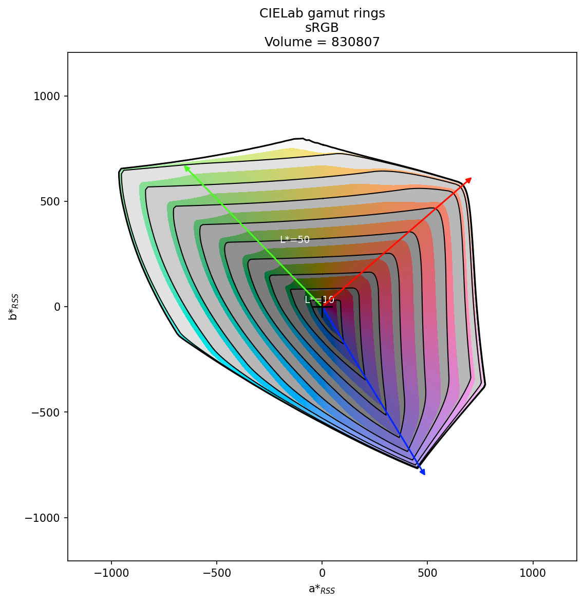

# `cgt plot rings` — Ring diagram reference

The rings diagram shows a gamut's extent in the a*-b* plane, with L* encoded as
concentric ring radii. Each ring is the C\*_RSS chroma envelope at one L* level,
so the full shape of the gamut body is visible in a single 2D plot.



*sRGB gamut shown as intersection with BT.2020 reference (`-r bt.2020 -i`).*

---

## Quick start

```bash
# DUT only
cgt plot rings display.txt

# With a reference gamut overlaid
cgt plot rings display.txt -r srgb

# Intersection view (DUT clipped to reference)
cgt plot rings display.txt -r srgb -i

# Save to file (PNG, PDF, SVG, JPEG, TIFF supported)
cgt plot rings display.txt -r srgb -o rings.png --dpi 200
```

Named gamuts accepted everywhere: `srgb`, `bt.2020`, `dci-p3`, `display-p3`, `adobe-rgb`.

---

## Reference and intersection

| Option | Short | Description |
|---|---|---|
| `--reference GAMUT` | `-r` | Overlay a reference gamut. Accepts a file path or named gamut. |
| `--reference2 GAMUT` | | Second reference shown as an outer dotted ring outline only. |
| `--intersection` | `-i` | Show the DUT gamut as its intersection with the reference (requires `-r`). |

```bash
# DUT vs sRGB reference
cgt plot rings display.txt -r srgb

# DUT vs sRGB, with BT.2020 outer outline for context
cgt plot rings display.txt -r srgb --reference2 bt.2020

# Intersection (DUT ∩ sRGB)
cgt plot rings display.txt -r srgb -i
```

---

## Ring levels

By default the diagram draws nine rings at L* = 10, 20, 30, 40, 50, 60, 70, 80, 90.

| Option | Description |
|---|---|
| `--l-rings L1,L2,...` | Override ring levels (comma-separated L* values). |

```bash
# Coarser rings
cgt plot rings srgb --l-rings 20,40,60,80
```

---

## Colour bands

The filled bands between rings are coloured by the approximate hue at each angular
position. They are on by default and can be tuned or removed.

| Option | Default | Description |
|---|---|---|
| `--bands` / `--no-bands` | on | Show or hide the colour-fill bands. |
| `--band-chroma FLOAT` | 50 | Chroma (C\*) of the band fill colours. |
| `--band-ls VALUE` | `20,90` | Lightness of bands — single value or `LO,HI` range interpolated from inner to outer ring. Use `--band-ls=VAL` for negative values. |

```bash
# Muted bands
cgt plot rings srgb --band-chroma 25

# Uniform lightness across bands
cgt plot rings srgb --band-ls 50

# Gradient from dark to light
cgt plot rings srgb --band-ls=10,95
```

---

## Primary-colour arrows

Arrows from the centre (or from the outer ring boundary) towards each primary/secondary
colour direction. Coloured by the approximate Lab→sRGB value at that primary.

| Option | Default | Description |
|---|---|---|
| `--primaries none\|rgb\|all` | `rgb` | DUT primary arrows: none, R/G/B only, or R/G/B/C/M/Y. |
| `--ref-primaries none\|rgb\|all` | `none` | Reference primary arrows. |
| `--primary-color input\|output` | `output` | Arrow head colour: `output` uses measured Lab→sRGB; `input` uses the nominal R/G/B colour. |
| `--primary-origin centre\|ring` | `centre` | Arrow start: from the centre, or from the outer ring boundary. |
| `--cent-mark` / `--no-cent-mark` | on | Show or hide the centre cross marker. |

```bash
# All six colour directions
cgt plot rings srgb --primaries all

# Reference arrows too
cgt plot rings display.txt -r srgb --ref-primaries rgb

# Arrows from ring boundary outward
cgt plot rings display.txt --primary-origin ring
```

---

## Constant-chroma reference circles

Draw circular grid lines at fixed C\* radii, useful for reading off chroma values.

| Option | Description |
|---|---|
| `--chroma-rings C1,C2,...` | Comma-separated C\* radii (e.g. `50,100,150`). |

```bash
cgt plot rings srgb --chroma-rings 50,100,150
```

---

## Plot decoration

| Option | Description |
|---|---|
| `--title TEXT` | Override the auto-generated plot title. |
| `--no-title` | Suppress the title entirely. |
| `--figsize W,H` | Figure size in inches (default `8,8`). |
| `--xlim MIN,MAX` | Override a\* axis limits. Use `--xlim=VAL` for negatives. |
| `--ylim MIN,MAX` | Override b\* axis limits. Use `--ylim=VAL` for negatives. |

---

## Output

If neither `--output` nor `--show` is given the plot is shown interactively.
Providing `--output` without `--show` uses a non-interactive backend (no display required).

**Note:** the output directory must already exist — `cgt` will not create it.

| Option | Short | Default | Description |
|---|---|---|---|
| `--output PATH` | `-o` | — | Save to file. Format inferred from extension. |
| `--show` | | `False` | Show the plot interactively (can be combined with `--output`). |
| `--dpi INT` | | 150 | Resolution for raster formats (PNG, JPEG, TIFF). |

Supported formats: `.png`, `.pdf`, `.svg`, `.jpg` / `.jpeg`, `.tiff`.

---

## Full option reference

| Option | Short | Default | Description |
|---|---|---|---|
| `GAMUT` | | | CGATS file path or named gamut (positional). |
| `--reference` | `-r` | — | Reference gamut. |
| `--reference2` | | — | Second reference (outer outline only). |
| `--intersection` | `-i` | off | Intersection view (requires `-r`). |
| `--l-rings L,...` | | `10,20,...,90` | Ring L* levels. |
| `--bands` / `--no-bands` | | on | Colour-fill bands. |
| `--band-chroma F` | | 50 | Band fill chroma. |
| `--band-ls V` or `LO,HI` | | `20,90` | Band lightness. |
| `--primaries` | | `rgb` | DUT primary arrows: `none`, `rgb`, `all`. |
| `--ref-primaries` | | `none` | Reference primary arrows. |
| `--primary-color` | | `output` | Arrow colour source: `input` or `output`. |
| `--primary-origin` | | `centre` | Arrow origin: `centre` or `ring`. |
| `--cent-mark` / `--no-cent-mark` | | on | Centre cross marker. |
| `--chroma-rings C,...` | | — | Constant-chroma reference circles. |
| `--title TEXT` | | auto | Plot title. |
| `--no-title` | | — | Suppress title. |
| `--figsize W,H` | | `8,8` | Figure size in inches. |
| `--xlim MIN,MAX` | | auto | a\* axis limits. |
| `--ylim MIN,MAX` | | auto | b\* axis limits. |
| `--output PATH` | `-o` | — | Output file. |
| `--show` | | `False` | Interactive display. |
| `--dpi INT` | | 150 | Raster resolution. |
