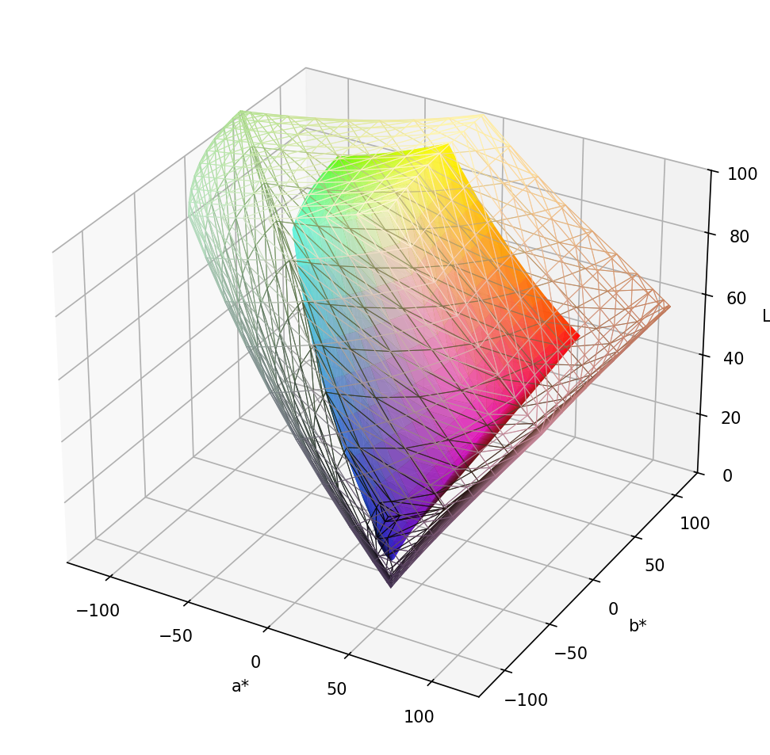

# `cgt plot surface` — 3D surface plot reference

The surface plot renders one or more gamut bodies as 3D objects in CIELab space,
coloured by their approximate sRGB value at each surface point. Multiple gamuts
can be overlaid on the same axes.



*sRGB solid surface with BT.2020 wireframe overlay (muted chroma, thin lines).*

---

## Quick start

```bash
# Single gamut
cgt plot surface display.txt

# Two gamuts overlaid — lower alpha to see through
cgt plot surface srgb bt.2020 --alpha 0.4

# Save to file
cgt plot surface display.txt srgb -o comparison.png
```

Named gamuts accepted everywhere: `srgb`, `bt.2020`, `dci-p3`, `display-p3`, `adobe-rgb`.

---

## Solid surfaces and alpha

`--alpha` controls face transparency for all solid gamuts (0 = fully transparent,
1 = opaque). Lower values let you see through overlapping surfaces.

```bash
cgt plot surface srgb bt.2020 --alpha 0.4
```

---

## Wireframe mode

`--wireframe` renders all gamuts as edges only (no filled faces). Edge colours
follow the same Lab→sRGB mapping as solid surfaces unless overridden with `--style`.

```bash
cgt plot surface srgb bt.2020 --wireframe
```

---

## Per-gamut style with `--style`

`--style` gives independent control over each gamut's rendering. It takes a
comma-separated list with one entry per gamut, aligned positionally. Empty entries
(including trailing commas) use the library defaults.

`--style` cannot be combined with `--wireframe` or `--alpha`.

### Style syntax

Each entry is a set of tokens joined by `+`:

```
--style "TOKEN+TOKEN+...,TOKEN+TOKEN+...,..."
        \___ gamut 0 ___/ \___ gamut 1 ___/
```

### Style tokens

| Token | Description |
|---|---|
| `wireframe` | Render this gamut as edges only. |
| `alpha:FLOAT` | For solid: face opacity (0–1). For wireframe: edge opacity. |
| `grey` / `gray` | Shorthand for `chroma:0+lightness:50` — uniform mid-grey edges. |
| `color:VALUE` / `colour:VALUE` | Fixed edge colour. Accepts `#RRGGBB`, bare `RRGGBB`, or any matplotlib named colour. Mutually exclusive with `chroma`, `lightness`, `grey`/`gray`. |
| `chroma:FLOAT` | Scale the a\*, b\* components of auto-computed edge colours (0 = grey, 1 = full colour). |
| `lightness:FLOAT` | Override the L\* of auto-computed edge colours (0–100). Can be combined with `chroma`. |
| `lw:FLOAT` | Edge line width in points (wireframe only). |

`chroma` and `lightness` modify the Lab values used to compute edge colours before
converting to sRGB. They can be used independently: `chroma:0.3` mutes saturation
while keeping lightness variation; `lightness:50` pins lightness to mid-grey while
keeping hue and saturation.

### Examples

```bash
# Gamut 0 solid at full opacity, gamut 1 wireframe (defaults)
cgt plot surface srgb bt.2020 --style "alpha:1.0,wireframe"

# Solid sRGB, BT.2020 wireframe in mid-grey
cgt plot surface srgb bt.2020 --style ",wireframe+grey"

# Solid sRGB, BT.2020 wireframe muted to 20% chroma, thin lines
cgt plot surface srgb bt.2020 --style ",wireframe+chroma:0.2+lw:0.5"

# Both wireframe, fixed dark-red and dark-blue
cgt plot surface srgb bt.2020 --style "wireframe+colour:#800000,wireframe+colour:#000080"

# Three gamuts: solid / wireframe grey / solid half-transparent
cgt plot surface srgb bt.2020 dci-p3 --style "alpha:0.9,wireframe+grey+lw:1.0,alpha:0.4"

# Gamut 0 default solid, gamut 1 wireframe with 60% lightness and half-chroma
cgt plot surface srgb bt.2020 --style ",wireframe+chroma:0.5+lightness:60"

# Trailing comma — gamuts 1 and 2 use library defaults
cgt plot surface srgb bt.2020 dci-p3 --style "wireframe,"
```

---

## 3D view angle

| Option | Description |
|---|---|
| `--elev FLOAT` | Elevation angle in degrees (default ~30°). |
| `--azim FLOAT` | Azimuth angle in degrees (default ~-60°). |

```bash
cgt plot surface srgb --elev 45 --azim 30
```

---

## Gamut labels and legend

Use `--label` to name each gamut. Labels appear in the legend and are derived
automatically when not specified: the `DISPLAY_LABEL` keyword in the CGATS file
is used first, then the filename stem, then the named gamut's standard name.

`--label` takes a comma-separated list aligned positionally with the gamut
arguments. An empty element keeps the auto-derived label.

The legend is shown by default when multiple gamuts are plotted. Use `--legend`
or `--no-legend` to force it on or off.

```bash
# Two gamuts with explicit labels and legend
cgt plot surface srgb bt.2020 --label "sRGB,BT.2020" --legend -o comparison.png

# Override only the first label; second keeps its auto name
cgt plot surface display.txt srgb --label "Wide gamut panel," --legend -o out.png

# Single gamut with a legend entry
cgt plot surface display.txt --label "Prototype A" --legend -o out.png

# Multiple gamuts, suppress the auto legend
cgt plot surface srgb bt.2020 --no-legend -o out.png
```

---

## Plot decoration

| Option | Default | Description |
|---|---|---|
| `--label TEXT` | — | Comma-separated gamut labels (aligned with gamut arguments). Empty element keeps auto-derived label. |
| `--legend` / `--no-legend` | on for multiple gamuts | Show or hide the gamut legend. |
| `--title TEXT` | — | Set the plot title. |
| `--figsize W,H` | `10,8` | Figure size in inches. |
| `--xlim MIN,MAX` | `-128,128` | a\* axis limits. Use `--xlim=VAL` for negatives. |
| `--ylim MIN,MAX` | `-128,128` | b\* axis limits. |
| `--zlim MIN,MAX` | `0,100` | L\* axis limits. |

---

## Output

If neither `--output` nor `--show` is given the plot is shown interactively.
Providing `--output` without `--show` uses a non-interactive backend (no display required).

**Note:** the output directory must already exist — `cgt` will not create it.

| Option | Short | Default | Description |
|---|---|---|---|
| `--output PATH` | `-o` | — | Save to file. Format inferred from extension. |
| `--show` | | `False` | Show interactively (can be combined with `--output`). |
| `--dpi INT` | | 150 | Resolution for raster formats. |

Supported formats: `.png`, `.pdf`, `.svg`, `.jpg` / `.jpeg`, `.tiff`.

---

## Full option reference

| Option | Short | Default | Description |
|---|---|---|---|
| `GAMUTS...` | | | One or more CGATS files or named gamuts (positional). |
| `--alpha F` | | 0.8 | Global solid surface transparency. |
| `--wireframe` | | off | All gamuts as wireframe. |
| `--style TEXT` | | — | Per-gamut style string (see above). |
| `--label TEXT` | | — | Comma-separated gamut labels. |
| `--legend` / `--no-legend` | | on for multiple gamuts | Show or hide legend. |
| `--title TEXT` | | — | Plot title. |
| `--figsize W,H` | | `10,8` | Figure size in inches. |
| `--xlim MIN,MAX` | | `-128,128` | a\* axis limits. |
| `--ylim MIN,MAX` | | `-128,128` | b\* axis limits. |
| `--zlim MIN,MAX` | | `0,100` | L\* axis limits. |
| `--elev F` | | matplotlib default | Elevation angle (degrees). |
| `--azim F` | | matplotlib default | Azimuth angle (degrees). |
| `--output PATH` | `-o` | — | Output file. |
| `--show` | | `False` | Interactive display. |
| `--dpi INT` | | 150 | Raster resolution. |
